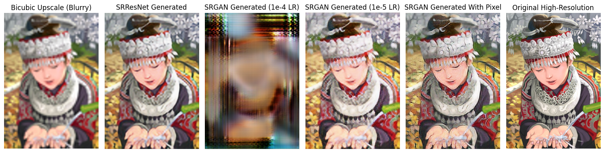

# SRGAN-Implementation

An implementation of Photo-Realistic Single Image Super-Resolution Using a Generative Adversarial Network from scratch.

The goal of the model is to train a generator that is able to generate a high-resolution image from a low-resolution image that looks like the original image.

The repository is structured as follows:

- model_components: Contains the model components for the SRGAN.
- DIV2K_train_HR: Contains the training data for the SRGAN.
- DIV2K_valid_HR: Contains the validation data for the SRGAN.
- logs: Contains the training logs for the SRGAN.
- models: Contains the models for the SRGAN, each with a descriptive name.
- config.json: Contains the configuration for the SRGAN training.
- run_training.sh: Contains the script to run the SRGAN training. Not completed, only for reference.
- requirements.txt: Contains the dependencies for the SRGAN.


## Paper

The implementation is based on the following paper:

```
@misc{ledig2017photorealisticsingleimagesuperresolution,
  title={Photo-Realistic Single Image Super-Resolution Using a Generative Adversarial Network}, 
  author={Christian Ledig and Lucas Theis and Ferenc Huszar and Jose Caballero and Andrew Cunningham and Alejandro Acosta and Andrew Aitken and Alykhan Tejani and Johannes Totz and Zehan Wang and Wenzhe Shi},
  year={2017},
  eprint={1609.04802},
  archivePrefix={arXiv},
  primaryClass={cs.CV},
  url={https://arxiv.org/abs/1609.04802}, 
}
```

## Dataset

Dataset used:

```
@InProceedings{Agustsson_2017_CVPR_Workshops,
	author = {Agustsson, Eirikur and Timofte, Radu},
	title = {NTIRE 2017 Challenge on Single Image Super-Resolution: Dataset and Study},
	booktitle = {The IEEE Conference on Computer Vision and Pattern Recognition (CVPR) Workshops},
	month = {July},
	year = {2017}
}
```

## Overview

The novelty of this architecture is the replacement of the traditional MSE loss with a perceptual loss. By using a metric that considers more than just peak signal to noise ratio, the model is able to generate more realistic images with better details on textures and edges. This is because PSNR measures the differences pixel by pixel, instead of the perceptual differences between the original and the generated image in human eye.

## Data Preprocessing

**Obtaining downsampled images:** Applying gaussian filter to original images then downsampling by a factor of 4.

## Architecture

### Generator

1. 1 convolution layer with 64 feature maps, kernel size 9x9, stride 1
2. ParametricReLU activation function (PReLU)
3. 16 residual blocks
   - 2 convolution layers with 64 feature maps, kernel size 3x3, stride 1, padding 1
   - Batch normalization
   - ParametricReLU activation function (PReLU)
   - Elementwise sum with skip connection
4. 1 convolution layer with 64 feature maps, kernel size 3x3, stride 1, padding 1, batch normalization and element wise sum with output of first PReLU layer
5. 1 subpixel convolutional layer with 256 feature maps, kernel size 3x3, stride 1, padding 1, followed by 2 pixel shufflers layer that maps 256 feature maps to 64 map image that is 2x larger in width and height, then a PReLU
6. 1 upsampling layer with 1 convolutional layer with 256 feature maps, kernel size 3x3, stride 1, padding 1, followed by 2 pixel shufflers layer that maps 256 feature maps to 64 map image that is 2x larger in width and height, then a PReLU
7. A 9x9 convolution layer that maps 64 feature maps to 3 feature maps, stride 1, padding 4, then a Tanh activation function

### Discriminator

1. 1 convolution layer with 64 feature maps, kernel size 3x3, stride 1, padding 1
2. Leaky ReLU activation function
3. 7 convolution layers with increasing number of feature maps (64, 128, 128, 256, 256, 512, 512), kernel size 3x3, stride 1, padding 1 and alternating between stride 1 and stride 2. Followed by batch normalization and Leaky ReLU activation function
4. 1 dense layer with 1024 tensor and Leaky ReLU activation function
5. 1 dense layer with 1 tensor and sigmoid activation function

## Loss Function

### Perceptual Loss

Combination of content loss and adversarial loss:

**Content loss + 10^(-3) × Adversarial loss**

### Content Loss

VGG loss: both generated and original image are passed through a pre-trained VGG19 model and the loss is computed between the feature maps of the two models using the euclidean distance. The feature maps are compared at one specific layer of the VGG19 model.

### Adversarial Loss

Normal loss between the generated probability and the original ground truth: **-log(D(G(x)))**

### Training Strategy

The training is trained with a batch of 16, and cropped a random a 96x96 image.

The generator is trained first using the MSE loss to learn the mapping from LR to HR images. Then the overall GAN is trained using with the pretrained generator as a starting point. This is to avoid undesired local optima.

For the loss function, I made a small modification to the original loss function. I added a pixel loss to the loss function to avoid the collapse of the generator. This is because without this loss, the generator will learn to output unrecognizable images. It could be the sheer number of epochs needed to train the generator to output realistic images. The original paper ran for 1million iterations for pretraining, and 200k iterations for training. But with only 300-500 epochs, this loss calculation is better. Arguably there's a difference a difference with original perceptual loss after adding this pixel loss. But the pixel loss is more stable and faster to train.

The pretraining is done for 200 epochs with a learning rate of 0.0001.

The training for GAN is done in 2 stages, first at a learning rate of 0.0001 for 50 epochs, then at a learning rate of 0.00001 for 50 epochs.

## Results

Example of the generated image with side by side comparison with the original image and the bicubic upscaled image.



The test results are as follows:

| Model | PSNR | SSIM |
|-------|------|------|
| SRGAN | 26.8441 | 0.7556 |

